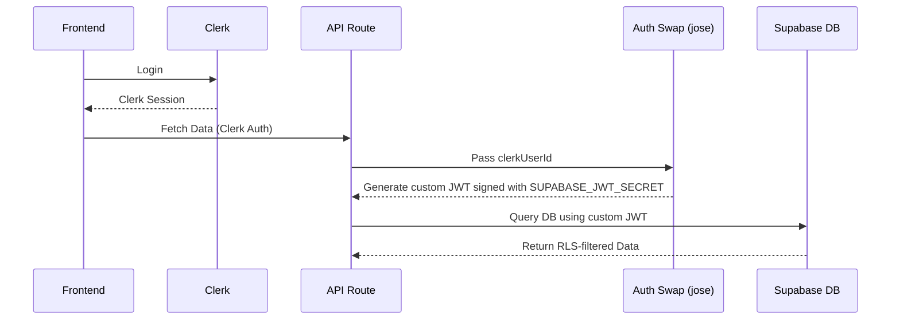

# Supabase Auth Swap Mechanism

File: `src/lib/supabase-auth-swap.ts`

Because Skripted uses **Clerk** for frontend user authentication but **Supabase** for the database (and RLS), we need a way to tell Supabase *who* is making requests from the server-side.

## Architecture Diagram

## How It Works
Instead of using Supabase's native auth module directly, we generate a custom JWT signed with the `SUPABASE_JWT_SECRET`.

1. We take the `clerkUserId`.
2. We craft a payload setting the role to `authenticated` and the `sub` (subject) to the `clerkUserId`.
3. We set an expiration (`exp`) of 24 hours.
4. We sign it using the `jose` library (which works well in Edge runtimes like Next.js middleware).

## Usage
This custom token is then injected into the Supabase client creation process (likely in `supabase-server.ts`), allowing Supabase to apply its Row Level Security policies (see [[Database Implementation Details]]) based on the Clerk user ID.
